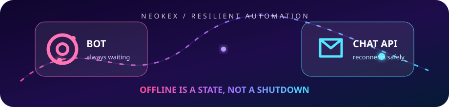

<div align="center">
  
  <h1>Insta Bot V1</h1>
  <p>Resilient Instagram automation powered by a private Chat API.</p>
  <p>
    <a href="https://github.com/lazyneoaz/InstaBot-V1">Source</a>
    &middot;
    <a href="https://github.com/lazyneoaz/Insta-Chat-API-Client">Chat client</a>
    &middot;
    <a href="https://neokex.xyz">NeoKEX</a>
  </p>
</div>

## Overview

Insta Bot V1 is a modular Instagram command bot that authenticates with a local Netscape-format
cookie export, connects through `@lazyneoaz/insta-chat-client`, and receives realtime events from the
private Chat API.

The bot is designed to stay alive during Chat API downtime. It waits for the API health endpoint,
retries authentication with capped exponential backoff, and re-authenticates automatically when a
server restart invalidates the previous realtime session.

## Features

- Automatic startup recovery during outages and maintenance windows.
- Automatic Chat API session recovery after WebSocket disconnects or server restarts.
- MQTT-backed Instagram realtime events through the private server.
- Command aliases, permissions, cooldowns, reply handlers, reaction handlers, and hot reload.
- Persistent bot state with bounded history and thread/user storage.
- Shared API client with normalized messages, media helpers, reactions, effects, and group controls.
- Default `alldl` media downloader for supported public URLs.
- Explicit shutdown for `SIGINT` and `SIGTERM`.

## Architecture

```text
account.txt + Chat API token
             |
             v
Insta Bot V1 --> @lazyneoaz/insta-chat-client --> Private Chat API --> Instagram
                    HTTPS + authenticated WebSocket       MQTT + private cookies
```

The public bot never contains the private `nkxica` implementation or the server's Instagram session
data. Cookies are read locally and sent over HTTPS only for the current authenticated session.

## Requirements

- Node.js 20 or newer.
- A Netscape-format Instagram cookie export.
- Network access to `https://nkx-ica.neokex.xyz`.

## Quick Start

```bash
git clone https://github.com/lazyneoaz/InstaBot-V1.git
cd InstaBot-V1
npm install
cp .env.example .env
```

Place your cookie export at `./account.txt`. Keep it private and never commit it.

The shared Chat API token is currently:

```dotenv
CHAT_API_TOKEN=chat.api.toke.neokex.ica.token.can.change.a9y.2ime.ok
```

The token is intentionally usable by bot installations. The server owner may rotate it, so keep the
value in `.env` and update it when the server publishes a replacement.

Start the bot:

```bash
npm start
```

The bot will keep the process alive while the Chat API is unavailable. It logs each retry and backs
off from `CHAT_API_RETRY_DELAY_MS` up to `CHAT_API_MAX_RETRY_DELAY_MS`.

Media downloads use the default `alldl` command:

```text
!alldl <public URL>
```

The command is loaded automatically from `scripts/cmds/alldl.js` and uses the bot's downloader API.
It selects the best supported video result, with image and audio fallbacks when returned by the
service.

## Docker Deployment

The repository includes a Dockerfile for Render Web Services, Railway, and other container hosts.
The image listens on `PORT` (default `10000`) and exposes `/`, `/health`, and `/healthz` so the
platform can see that the bot process is alive while it waits for the Chat API.

```bash
docker build -t insta-bot-v1 .
docker run --rm \
  -p 10000:10000 \
  -e CHAT_API_URL=https://nkx-ica.neokex.xyz \
  -e CHAT_API_TOKEN=chat.api.toke.neokex.ica.token.can.change.a9y.2ime.ok \
  -e ACCOUNT_FILE=/run/secrets/account.txt \
  -v "$PWD/account.txt:/run/secrets/account.txt:ro" \
  insta-bot-v1
```

`node_modules/` and `package-lock.json` are excluded from the Docker build context. The image runs
`npm install` during its build, so dependencies are generated inside the image. Do not copy cookies
or `.env` into the image.

For Render or Railway, provide the cookie export as a secret file and set `ACCOUNT_FILE` to the
mounted path shown by that platform. Keep the service port set to the platform-provided `PORT`.

## Configuration

The normal settings live in `config.json`. Environment variables override the Chat API settings:

| Variable | Default | Purpose |
| --- | ---: | --- |
| `ACCOUNT_FILE` | `./account.txt` | Path to the Netscape cookie file; use the platform secret-file path in containers |
| `PORT` | `10000` | HTTP health-server port supplied by Render or Railway |
| `CHAT_API_URL` | `https://nkx-ica.neokex.xyz` | Private Chat API base URL |
| `CHAT_API_TOKEN` | shared token | Bearer token for the Chat API |
| `CHAT_API_TIMEOUT_MS` | `30000` | HTTP and health-check timeout |
| `CHAT_API_RECONNECT_DELAY_MS` | `3000` | Realtime reconnect delay |
| `CHAT_API_RETRY_DELAY_MS` | `5000` | First startup/re-authentication retry delay |
| `CHAT_API_MAX_RETRY_DELAY_MS` | `60000` | Maximum startup/re-authentication retry delay |

Administrative IDs, allowed threads, blocked threads, and command settings should be configured in a
local `config.json`. Do not publish private account cookies, owner IDs, or deployment secrets.

## Chat API Rate Limits

There are two independent limits:

### Public Chat API boundary

- Authenticated HTTP requests are counted per source IP in a fixed one-minute window.
- The default is `120` requests per minute.
- The server owner can change it with `CHAT_API_RATE_LIMIT`.
- The `GET /healthz` and `OPTIONS` routes are not counted.
- WebSocket event traffic is not counted by this HTTP request counter.
- Exceeding the limit returns HTTP `429` with code `RATE_LIMITED`.
- The server allows `10` authenticated sessions by default; excess login attempts return `SESSION_LIMIT`.

### Instagram upstream protection

The private server also uses an adaptive limiter before Instagram requests:

- Safe mode keeps at least `1500 ms` between requests globally.
- Each endpoint starts with a `1000 ms` minimum delay.
- A `429` with `Retry-After` raises that endpoint delay to the requested value, capped at `60 seconds`.
- A `429` without `Retry-After` doubles the endpoint delay, also capped at `60 seconds`.
- Ten consecutive successful responses gradually relax an elevated endpoint delay.

Do not bypass either layer with request floods. The bot's command cooldown and the private server's
adaptive limiter exist to protect the Instagram account and the shared API.

## Reliability Behavior

| Situation | Bot behavior |
| --- | --- |
| Chat API is down | Waits for `/healthz`, logs a warning, and retries forever with backoff |
| Chat API is under maintenance | Keeps the process alive and retries authentication automatically |
| API server restarts | Clears the stale session and performs a fresh cookie login |
| Temporary realtime disconnect | Uses client reconnect plus bot-level recovery |
| Instagram session expires | Stops safely and asks for a refreshed `account.txt` |
| Instagram account is restricted | Stops safely for manual review |

## Security

- Never commit `account.txt`, `.env`, cookies, or personal access tokens.
- The shared Chat API token is not an Instagram login credential, but it still grants API access and
  may be rotated at any time.
- Cookies are sent over HTTPS to the private server and are not written by this public bot to the
  server's source repository.
- Keep logs and screenshots free of cookie contents and authorization headers.

## Credits

Created and maintained by **Saifullah Al Neoaz (NEOKEX)**.

- Website: [neokex.xyz](https://neokex.xyz)
- GitHub: [@lazyneoaz](https://github.com/lazyneoaz)
- Public bot: [InstaBot-V1](https://github.com/lazyneoaz/InstaBot-V1)
- Chat client: [insta-chat-client](https://github.com/lazyneoaz/Insta-Chat-API-Client)
- Private server: [Insta-Chat-API-Server](https://github.com/lazyneoaz/Insta-Chat-API-Server)

This project uses the open-source `nkxica` Instagram client layer inside the private server. Please
respect Instagram's terms, rate limits, and account-safety requirements.

## License

See [LICENSE](./LICENSE).
